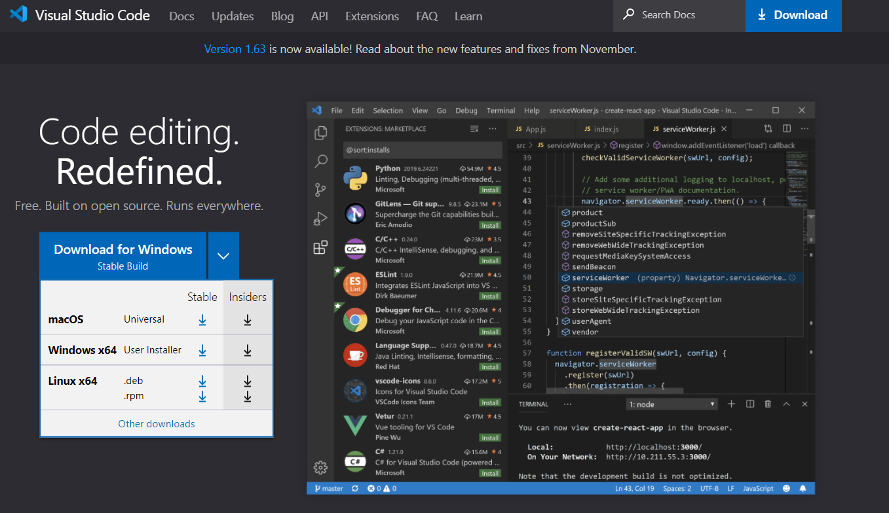
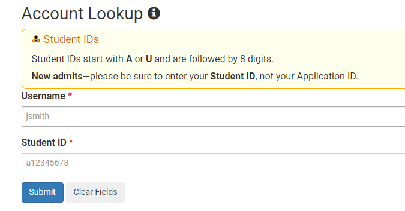
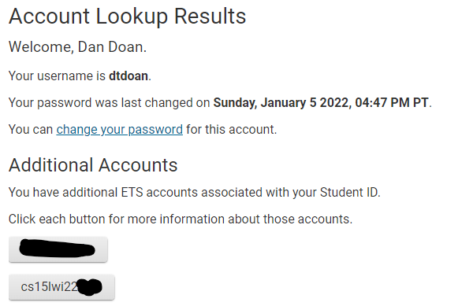
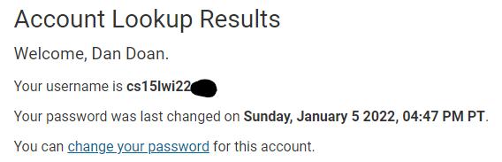
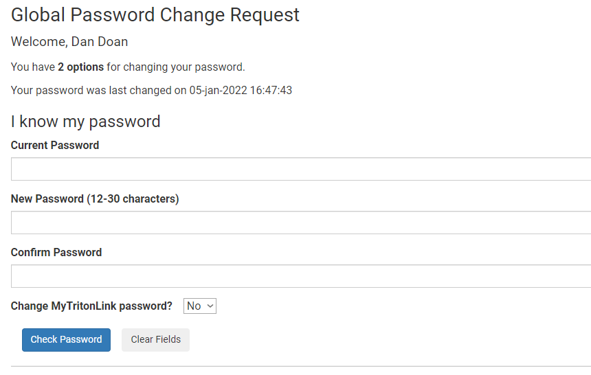
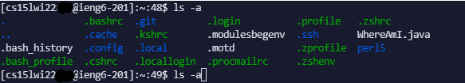
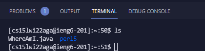
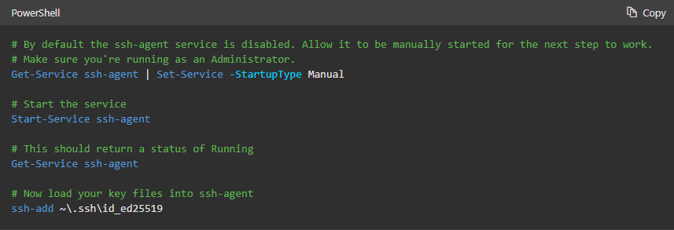
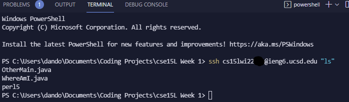

# Lab Report 1

In this report we will be exploring how to create log into a course specific account on ieng6 using the vscode terminal on a windows machine.

## Part 1 - Installing VSCode

The first thing we have to do is to install Visual Studio Code (VSCode) a coding IDE that we will use to log into ieng6. Here is the link for the download. [VSCode download](https://code.visualstudio.com)

Once opened you should see a page similar to the image below and you should click on the dropdown caret in order to install VSCode for your specific OS.



## Part 2 - Remotely Connecting

Since this guide is for Windows we need to install or enable OpenSSH, provided here: [OpenSSH](https://docs.microsoft.com/en-us/windows-server/administration/openssh/openssh_install_firstuse)

After OpenSSH is enabled we now need to get our specific ieng6 account which will appear in this format `cs15lwi22zz@ieng6.ucsd.edu` with the wi22 being the current term and zz being account specific characters.

In order to do this we first need to create a password for this account which will be done through the [UCSD account lookup page](https://sdacs.ucsd.edu/~icc/index.php). We're going to login to the **Account Lookup** portion as pictured below. 



From here we are going to scroll down and click on the button labeled cs15lwi22xxx where the x's are account specific.



After clicking on that button it should take you to a page where you are going to click on the **change your password** button. 

*Note the username that appears on that page will be the username required for the next step.



From here you are going to enter the username from the previous step and your current password. There's a box to toggle whether you want to change your MyTritonLink password also which is optional but may be theoretically useful in the case that the school decides to make everyone change their password to a 12 digit password :).



Now you can go take a short nap since this will take the system sometime between 15-60 minutes to update. After waking up from your nap be prepared to start (slightly) less tedious tasks.

Wakey wakey now we're going to actually start the process of ssh'ing into our ieng6 account. First thing we are going to do is open VSCode and open a new terminal, which can be done either through the Ctrl +` command or you can press the terminal tab at the top and click on New Terminal. A box should pop up on the lower half of VSCode and you're going to put in the command below but instead of zz you're going to put your course username that we found a couple steps ago

`ssh cs15lwi22zz@ieng6.ucsd.edu`

If you put in the correct account name there should be a prompt that pops up in the terminal that wants you to establish the authenticity of ieng6. In order to get past this you want to type yes into the terminal and press enter.

Next it will prompt you for your password which you should fill out with the new password you created for this account. You should be able to now access your account, but if it doesn't work maybe the system hasn't updated the password in the 15-60 minute window that we gave it earlier or you typed in the password wrong.

*Note don't worry if nothing appears as you're typing your password in, VSCode doesn't visually show you typing it in for security reasons

## Part 3 - Trying Some Commands

In this section since we have successfully logged into our ieng6 accounts (hopefully) we're going to try out some command line tools. Try and figure out what they do yourself but if you are unable to then please consult overlord google for a detailed explanation.

* `cd ~`
* `cd`
* `ls -lat`
* `ls -a`
* `ls <directory>` where directory is `/home/linux/ieng6/cs15lwi22/cs15lwi22abc` but the abc is a group member's username
* `cp /home/linux/ieng6/cs15lwi22/public/hello.txt ~/`
* `cat /home/linux/ieng6/cs15lwi22/public/hello.txt`

*Note You are also able to log out of the ieng6 account by typing Ctrl-D or by typing the command exit into the terminal.

Here is an example of `ls -a` in my terminal 



## Part 4 - Moving Files with `scp`

Since now we have our ieng6 accounts setup and have someish knowledge of how some commands work, we're going to put that into practice by copying a file from our computer to the ieng6 server. 

First we're going to create a file in VSCode called `WhereAmI.java` and just put this code into it.

```
class WhereAmI {
  public static void main(String[] args) {
    System.out.println(System.getProperty("os.name"));
    System.out.println(System.getProperty("user.name"));
    System.out.println(System.getProperty("user.home"));
    System.out.println(System.getProperty("user.dir"));
  }
}
```

*Note this is done not in the ieng6 terminal so you will have to open a new terminal to run this on **your** machine

We're going to compile this code like how we normally would run a java file, through the javac and java commands one after another.

`javac WhereAmI.java`

`java WhereAmI`

You should get some information printed in your terminal after running those commands, but if you run into an error while trying to run it, make sure you're in the right directory. After the command works we are going to try and copy the `WhereAmI.java` file into our ieng6 account.

From our local computer's terminal (where we ran javac and java) we are going to type the command below but with your specific ieng6 account username.

`scp WhereAmI.java cs15lwi22zz@ieng6.ucsd.edu:~/`

It should ask for your password again (yes very annoying we will change this soon) and after you input your password it should transfer the file over. 

However we're extremely paranoid and want to check to make sure the file transfered correctly so we're going to ssh back into our account and then run the command `ls`

We should know see the `WhereAmI.java` file listed in the terminal.



## Part 5 - Setting an SSH Key

In this step we're going to setup a `ssh key`, which essentially automatically logs us into the ieng6 account without the need to type in a password.

Essentially what a `ssh key` does is that it creates two keys, a public and private one. We're going to copy this public key to a specific location on our server and keep the private key in a specific location on our machine where the files will act as an alternative to using a password.

Here is what we are going to run (thank you joe for the code)
```
# on client (your computer)
$ ssh-keygen
Generating public/private rsa key pair.
Enter file in which to save the key (/Users/joe/.ssh/id_rsa): /Users/joe/.ssh/id_rsa
Enter passphrase (empty for no passphrase): 
Enter same passphrase again: 
Your identification has been saved in /Users/joe/.ssh/id_rsa.
Your public key has been saved in /Users/joe/.ssh/id_rsa.pub.
The key fingerprint is:
SHA256:jZaZH6fI8E2I1D35hnvGeBePQ4ELOf2Ge+G0XknoXp0 joe@Joes-Mac-mini.local
The key's randomart image is:
+---[RSA 3072]----+
|                 |
|       . . + .   |
|      . . B o .  |
|     . . B * +.. |
|      o S = *.B. |
|       = = O.*.*+|
|        + * *.BE+|
|           +.+.o |
|             ..  |
+----[SHA256]-----+
```

This is probably overwhelming for you at first unless you have prior experience with ssh-ing into a server, but hold that confusion since we have an extra step since we're on Windows.

We are going to be using this [Microsoft Documentation](https://docs.microsoft.com/en-us/windows-server/administration/openssh/openssh_keymanagement#user-key-generation) as reference for the next step.

At this point you should have already generated your ssh keys but we need to enable the ssh-agent service where instructions are more detailed in the link above, but are also located in the picture below.



The final thing we need to do for this step is to copy the public key to the `.ssh` directory on the server. Example code to do this is listed below (thanks joe pt.2).

```
$ ssh cs15lwi22zz@ieng6.ucsd.edu
<Enter Password>
# now on server
$ mkdir .ssh
$ <logout>
# back on client
$ scp /Users/joe/.ssh/id_rsa.pub cs15lwi22@ieng6.ucsd.edu:~/.ssh/authorized_keys
# You use your username and the path you saw in the command above
```

*Note remember how we said we were going to copy the public key to the server? We now need the file location that it was saved on our computer in order to transfer the file over using `scp`. If we look to when we generated the keys, there is a line that says `Your public key has been saved in ...` where the `...` is the file location you will use for the scp command above. 

After you finish doing this you want to try and ssh back into the server and hopefully it should not prompt you for a password but instead log you in without it.

## Part 6 - Optimizing Remote Running

In this section we are going to explore some shortcuts that we can use to run commands in the remote server, but without going back and forth between our computer and the remote server.

This is done by a command that essentially logs into the remote server, runs a command and then exits the server. Try running the command below in **your computer's** terminal and you should see the home directory of the remote server (notice the quotes surrounding the command)

`ssh cs15lwi22@ieng6.ucsd.edu "ls"`

You should get an output similar to what is displayed below



Another shortcut is using semicolons to run multiple commands on the same line which you can test but running the command below.

`cp WhereAmI.java OtherMain.java; javac OtherMain.java; java WhereAmI`

The final shortcut is that you can press the up-arrow button when using your terminal to return to the previous command that you ran on the terminal.

## Conclusion

Congratulations you have now learned how to log into a course specific account on ieng6 through ssh. We have also explored basic commands, moved files to a remote computer, and learned how to automate the password process through creating a ssh key.