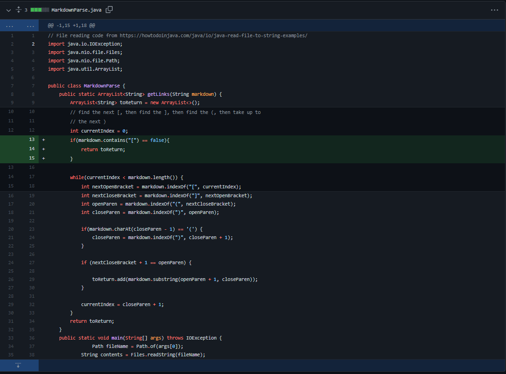
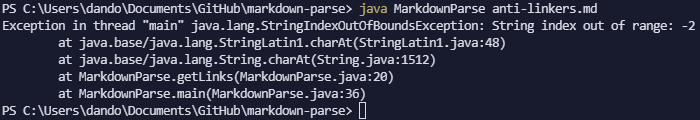
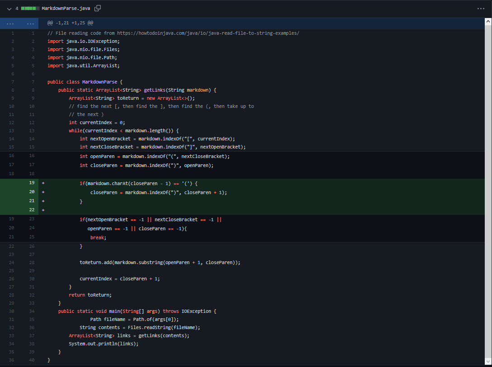
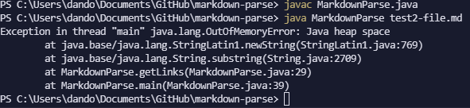
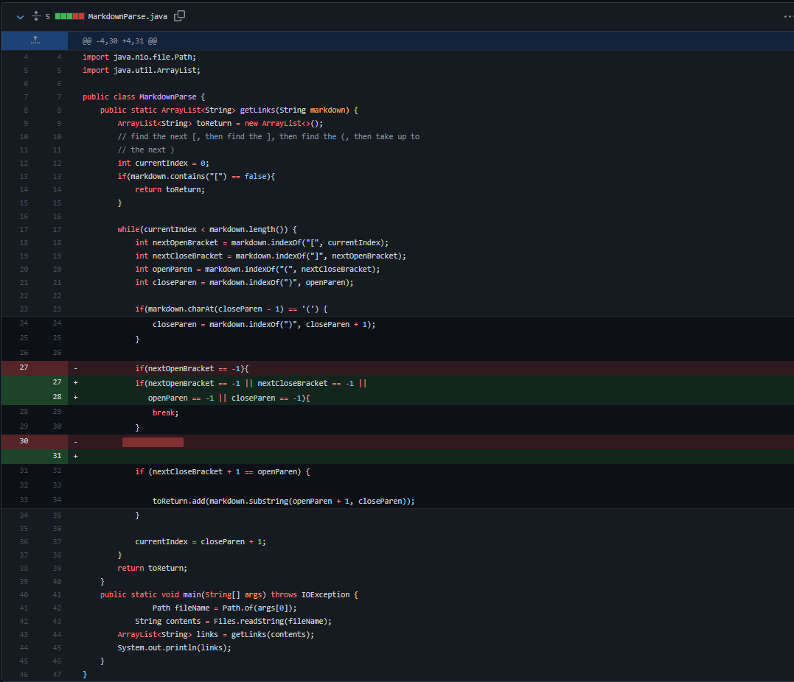
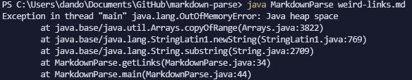

# Lab Report 2

[Back to Homepage](https://d-doan.github.io/cse15l-lab-reports/)

In this report we will focus on encountering and addressing symptoms and bugs in our code. Specifically, this will deal with the process of debugging through the use of testing and version control.

There will be a total of 3 tests represented in this report along with the process of how they were addressed.

## Problem 1: No valid link in file

The failure-inducing input that caused this change can be found in [anti-linkers.md](https://github.com/d-doan/markdown-parse/blob/main/anti-linkers.md)

I ran this test through the command: `java MarkdownParse anti-linkers.md` 

This led to the error message pictured below.

The symptom is the exception that was created through the command listed above.

The bug that was that since `MarkdownParse` was looking for an open bracket `[` but since `anti-linkers.md` did not contain any brackets at all, `MarkdownParse` assigned the variable `nextOpenBracket` to equal -1. This would lead to the error since `MarkdownParse` tries to access a negative index in an ArrayList.

I was able to mitigate this problem by checking if the file contained an open bracket before beginning the while loop, and returning an empty arrayList if it didn't contain it. 

*Note the reason why `MarkdownParse` is looking for an open bracket is because to create a link in markdown, you need to begin with an open bracket since the formatting is: `[link name](link url)`

## Problem 2: Text after link

The failure-inducing input that caused this change can be found in [test2-file.md](https://github.com/d-doan/markdown-parse/blob/main/test2-file.md)

I ran this test through the command: `java MarkdownParse test2-file.md` which led to the error pictured below.

The symptom was that when I ran the command above, the output took a long time to load until it resulted in the out of memory exception listed above. 

The bug occured because `MarkdownParse` expects the end of the file to be a `)` so since `test2-file.md` has text at the end, `MarkdownParse` is stuck in an infinite loop trying to find an open bracket to signify the next quote.

I was able to fix this problem by trying to see when the `nextOpenBracket` variable equals -1, since that would mean that there are no more '[' in the file. If this occured I would break the loop and return the ArrayList.

## Problem 3: Parentheses and Brackets within links 

The failure-inducing input that caused this change can be found in [weird-links.md](https://github.com/d-doan/markdown-parse/blob/main/weird-links.md)

I ran this test through the command `java MarkdownParse weird-links.md` which led to the error pictured below.

The symptom was extremely similar to our second failure-inducing input since they both have an `OutofMemoryError Exception`. This told me that an essentially infinite loop was being created again, and that I would have to catch certain cases and then break out of the loop if they existed within the file.

Specifically, the bug occured since the test case in `weird-links.md` was that there were `()` contained within the link. As such, `MarkdownParse` marked the `)` that was part of the link as the ending parenthesis. However it saw that there was still a `)` left in the file (which was supposed to end the link) and began looking for a open parenthesis after that but could not find it, leading to the `OutofMemoryError`.

In other to fix this bug, I edited my code change from the last test case to include `nextCloseBracket`, `openParen`, and `closeParen`. This allows our code to exit the loop if a certain parenthesis or bracket wasn't found.

## Conclusion

We are able to explore the process of debugging and the relationship between failure-inducing inputs, symptoms, and bugs in this lab. In the lab's relation to github, we were to commit whenever we encountered a failure-inducing input and also when we edited our code to accomodate for this input. This allows proper documentation for our debugging process, detailing our inputs, error messages, and code changes.

[Back to Homepage](https://d-doan.github.io/cse15l-lab-reports/)