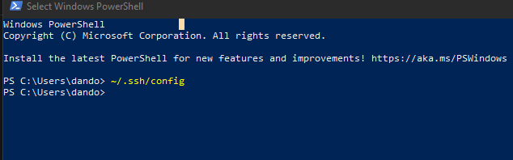
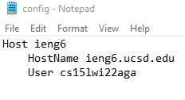
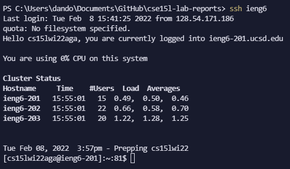
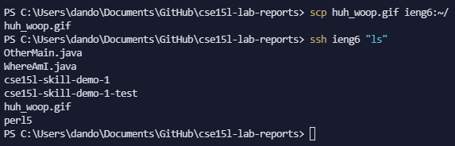

# Lab Report 3

[Back to Homepage](https://d-doan.github.io/cse15l-lab-reports/)

## Choice 1: Streamline `ssh` Configuration

In this lab report we will explore how to setup our `ssh` command into ieng6 through a more streamlined process, which will effectively save us the trouble of having to write out the entire address of our ieng6 account each time.

*Note this is setup using a Windows machine

## Step 1: `~/.ssh/config`

The first thing we need to do is to locate our file named `~/.ssh/config` which essentially tells our `ssh` command what username we want to use when logging in, which in this case is our ieng6 accounts. It also allows us to create a nickname for the server that we are trying to ssh into.

As such, we want to locate this file and add our own individual username into this file so that we can access our ieng6 accounts through the command `ssh ieng6`

In order to find out where `~/.ssh/config` is located, we are going to open up the Windows Powershell and then type `~/.ssh/config` into the terminal and press enter, which is pictured below.

Although in the picture it may not look like it did anything, if you complete that step on your personal computer, it should prompt you which what software you want to use to open and edit this file. Since we want to edit this file, we need a text editor, of which I chose notepad for simplicity purposes.

Once we have access to this file in your preferred text editor, we want to modify the file in a manner that gives it a nickname and provides our own ieng6 id. In the picture below, we can see that I have my nickname set as `ieng6` and I have my personal ieng6 account next to the User keyword.

The keyword `Host` in the file corresponds to the nickname that we give this connection, and thus will be the name we use when ssh'ing into the server later. The `HostName` keyword establishes which server we are connecting to which in this case is the ieng6 one. Finally, the `User` keyword links your own ieng6 account with the data above so that you don't have to type it out each time.

## Step 2: Verifying that it works

Since we have now setup out `~/.ssh/config` file to contain the information needed to ssh into the ieng6 server quickly and remotely, we can now put this in practice.

The first thing that we are going to do is to just ssh into the server through the `ssh ieng6` command, since we have designated the nickname of the server to be ieng6 in previous steps. As pictured below, this should allow us access into the server without typing out our indivdual ieng6 username.

Now that we have verified that we can ssh into the server quickly, we should now ask ourselves what commands will benefit from this change that we made. In the past we have worked with the `scp` command that allows us to copy files from our computer to the server and vice versa, but when working with this in the past we have had to type out our entire ieng6 user id so let's see how it changes.

The command that we will be running in the next step is `scp huh_woop.gif ieng6:~/`

Whereas the `ssh ieng6 "ls"` command is only used to verify that our file is properly copied over.

We are able to see that the file that we wanted to copy over, `huh_woop.gif`, is now located on our ieng6 machine and that it was significantly less annoying to run the `scp` command in this scenario when compared to running `scp` in the past.

[Back to Homepage](https://d-doan.github.io/cse15l-lab-reports/)