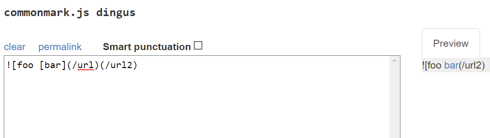
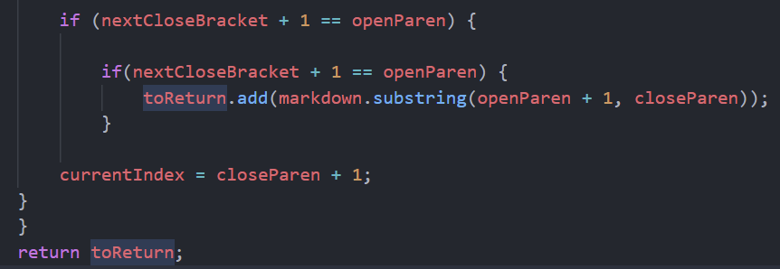

# Lab Report 5

[Back to Homepage](https://d-doan.github.io/cse15l-lab-reports/)

In this lab report, we will explore two different implementations of the `markdown-parse` repository through test cases from commonmark-spec. Specifically, we will look at two differences between my personal implementation of `markdown-parse` to the class repository. 

## How to find different test results

In order to test the 652 tests in commonmark-spec, I used the bash file `script.sh` to loop through test cases and print them to a file named `results.txt`. This was done through the command: `bash script.sh > results.txt`

After having these two `txt` files, I used the `diff` command which returns the difference between two files which were the two `results.txt` files (pictured below).

`diff cse15l-markdown-parse/results.txt markdown-parse/results.txt`

The terminal then prints out the difference in the two files along with the line number where it found the difference. The structure of each test can be seen below, where the first number and output correspond to the first file path that we used in diff, so in my case it would be the `cse15l` implementation of `markdown-parse`.

```
923c1059
< []
---
> [/url]
```

Although this is what most of the differences when running the `diff` command are, there is another case that only appears to print out 1 output, which is pictured below.

```
912a1045
> []
913a1047
```

The code snippet above represents the scenario where one of the implementations of `markdown-parse` prints out an empty list, meaning there were no links in the file, while the other implementation threw an error, which is why there is nothing printed from one of the implementations.

We will be exploring the two test cases that we found above and determing which implementation, or none, are 'correct'. The definition of what implemenation is right will be determined by the commonmark editor, which can be found [here](https://spec.commonmark.org/dingus/).


## Test case 1

```
923c1059
< []
---
> [/url]
```

Since we know that the output was the result of line 923 on my implementation of markdown-parse, we can open the respective test file in order to see the input which happens to be `[foo [bar](/url)(/url2)`

In this case, both outputs are not correct since we are defining correctness through the commonmark editor, which states that the only link in the file is `[bar]`.



The bug that caused my code to return `[/url]` was because my code does not account for unexpected `[`'s between a set of brackets, `[]`. To fix this I could add a tracker that checks for a duplicate of a grouping character that appears before its respective pair, so my code would search for another instance of `[` that appears before `]` and address it appropriately.

My current code is pictured below 




## Test case 2


[Back to Homepage](https://d-doan.github.io/cse15l-lab-reports/)