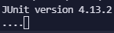
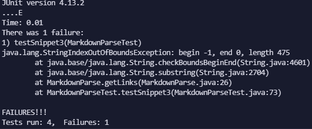
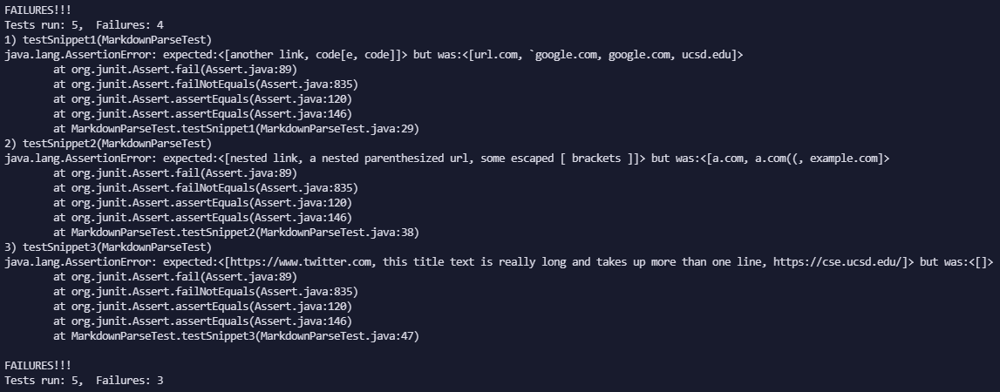

# Lab Report 4

[Back to Homepage](https://d-doan.github.io/cse15l-lab-reports/)

In this lab report we will further be exploring debugging through the use of more obscure test cases for our `markdown-parse` repository coupled writing Junit tests for these files.

## Adding Junit tests for our Snippets

In order to test our implementation of markdown-parse, and how it interacts with certain edge cases, we first need to create the edge cases inside our repository and also add Junit tests, which will allow us to easily evaluate our code against these tests.

Since our program is meant to work with markdown files, I created three files in my repository named `snippet1.md`, `snippet2.md`, and `snippet3.md` which mirror the examples found in the lab instructions [here](https://ucsd-cse15l-w22.github.io/week/week8/#week-8-lab-report)

After adding the three markdown files into my repo, I now used the Junit testing framework in order to test if my program worked as intended, to identify and add all valid links in a markdown file to an ArrayList.

My implementation for these tests can be found below, with each test method being named after their respective file.

Since we are also working with another group's repository in this lab report, I used Github Desktop to fork the reviewed directory and also added the snippet files and Junit tests in an identical process as above.

## My code is really broken

### Snippet 1

When running `snippet1.md` in my own code, I did not receive a statement of owhether my Junit tests failed or passed. Rather, there was 4 dots and continual loading which indicated to me that an infinite loop occured (pictured below).

In order to mitigate this infinite loop when dealing with backticks, we can add code that keeps track of the index of the first backtick and then look for the index of the next backtick. If the first backtick appears before the first bracket, its pair (the next backtick) should invalidate the link in between. We can do this by finding the next open bracket and making sure not to add anything to from the backtick line. However if the backtick starts within the pair of brackets or parentheses, the link is still valid.

### Snippet 2

For snippet 2, I was able to gather more information from the Junit testing framework since I did not encounter a infinite loop, but instead found myself with an `IndexOutOfBounds` exception(pictured below). 

Upon inspection within `snippet2.md` I saw that it is testing when there are groupings, either brackets or parentheses, nested within each other and that the exception was happening becasue there were either more groupings of one kind over the other. The markdown preview tells us that markdown ignores the nested grouping so we can fix this accordingly. 

We can make it so that after finding an open grouping symbol, our code looks to see if the symbol we just found appears before the next intended symbol, such as if another `[` appears before `]` and if so to just ignore the nested grouping and set the value of variables such as `nextOpenBracket` back to its original value.

### Snippet 3

For snippet 3, we initially appear to have a similar problem to Snippet 2 since we get a `IndexOutOfBounds` exception but this is a relatively common bug with this program so we should look further into it. The Junit test is pictured below.

When looking at the contents of `snippet3.md` I do not believe that this is a bug that is easily fixable within 10 lines. This is because the file tests multiple cases, such as when a title takes up one than 1 line, has line breaks, has missing parentheses, and also has extra text at the end. I believe that this is not a very practical test to start off with and that we can text all of these indivdual edge cases in their respective files and make sure that they work before attempting to combine them into one file. This would also help with our diagnosis since it would allow us to isolate which case, or cases, are the reason why our code does not run properly.

### Ran on reviewed code

When running the tests on the code that we reviewed from another group, we can see completely different error messages. While in my `markdown-parse` repo, one bug was an infinite loop and the other two were `IndexOutOfBounds` exceptions. Instead, the code we reviewed printed out lists for all 3 test cases, but they were incorrect lists compared to what we were looking for. This can mainly be attributed to my implementation to try and adapt to edge cases, but I did not account for the edge cases tested here while the reviewed code was relatively barebones and thus printed the lists wrong rather than having different exceptions.

The junit tests for the reviewed code is depicted below.

## Conclusion

Our current iteration of `MarkdownParse.java` is currently filled with bugs and errors when edge cases are presented to it, but we have explored the tools necessary to diagnose these symtpoms and respond accordingly by using Junit tests and what the terminal gives us when an exception is thrown. In addition, we could use a debugger such as jdb to help give us more information if necessary, such as in cases like `snippet1.md` where junit tests give us no information. Jdb would allow us to iterate through the loop one step at a time until we can isolate our problem and apply the proper fixes.

[Back to Homepage](https://d-doan.github.io/cse15l-lab-reports/)