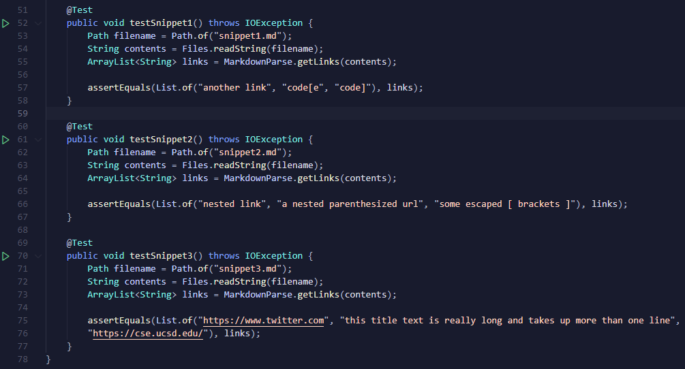

# Lab Report 4

[Back to Homepage](https://d-doan.github.io/cse15l-lab-reports/)

In this lab report we will further be exploring debugging through the use of more obscure test cases for our `markdown-parse` repository coupled writing Junit tests for these files.

## Adding Junit tests for our Snippets

In order to test our implementation of markdown-parse, and how it interacts with certain edge cases, we first need to create the edge cases inside our repository and also add Junit tests, which will allow us to easily evaluate our code against these tests.

Since our program is meant to work with markdown files, I created three files in my repository named `snippet1.md`, `snippet2.md`, and `snippet3.md` which mirror the examples found in the lab instructions [here](https://ucsd-cse15l-w22.github.io/week/week8/#week-8-lab-report)

After adding the three markdown files into my repo, I now used the Junit testing framework in order to test if my program worked as intended, to identify and add all valid links in a markdown file to an ArrayList.

My implementation for these tests can be found below, with each test method being named after their respective file.

Since we are also working with another group's repository in this lab report, I used Github Desktop to fork the reviewed directory and also added the snippet files and Junit tests in an identical process to above.

[Back to Homepage](https://d-doan.github.io/cse15l-lab-reports/)